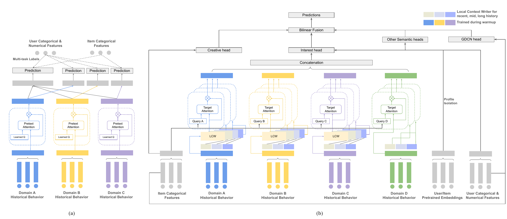

# Mad Scientists at TAAC 2026

We built this project for the
[KDD Cup 2026 Tencent UniRec Challenge](https://algo.qq.com/) under the name
**Mad Scientists**. We finished [**6th in the Industrial Track**](https://algo.qq.com/)
with a public leaderboard AUC of **0.8304**.

The challenge involved predicting post-click conversions from anonymized
advertising data. This repository contains the model and the pipeline we used
to train it and produce our submissions.

## Paper

Our paper is titled **Target-Aware Evidence Modeling and Fusion for Multi-Domain
Conversion Prediction**. It was accepted to the KDD Cup 2026 Tencent UniRec
Challenge Workshop at KDD 2026.

The paper was written by Siyue Yang\*
([@xiaoyanghazel](https://github.com/xiaoyanghazel)), Nima Sarang\*
([@nsarang](https://github.com/nsarang)) and Li Wang
([@elaineliwang7](https://github.com/elaineliwang7)).

Please use the citation below.

```bibtex
@inproceedings{yang2026targetaware,
  title     = {Target-Aware Evidence Modeling and Fusion for Multi-Domain
               Conversion Prediction},
  author    = {Yang, Siyue and Sarang, Nima and Wang, Li},
  booktitle = {KDD Cup 2026 Tencent UniRec Challenge Workshop},
  year      = {2026},
  month     = aug,
  address   = {Jeju, Republic of Korea}
}
```

## Architecture



*The left side shows behavior-aware pretext warmup while the right side shows
the supervised model.*

## Approach

Our solution treats conversion prediction as structured evidence reading. The
system brings together several parts.

- load-time context features that capture sequence presence and length as well
  as recency and conversion state. They also capture time context and
  target-history alignment while learned representations preserve missing-value
  information.
- separate dense and sparse optimization with dense-only EMA for stable
  checkpoint selection.
- a Conv1D Local Context Writer followed by Windowed-DIN to contextualize
  behavior tokens and extract target-relevant evidence from domain-specific
  temporal windows.
- a behavior-aware pretext warmup that initializes the sequence branch by
  predicting selected user and item attributes from domain-specific histories.
- signal-geometry-aware profile isolation and IACC evidence routes that keep
  interest and attention as well as creative and convenience signals distinct.
  GDCN and bilinear fusion then provide controlled cross-route interactions.

Our ablations showed that feature semantics and training stability mattered at
least as much as any individual architecture change and this became more
apparent as the training data scaled up.

Most experiments are controlled through YAML configs. The repository also
includes the losses and optimizers along with the streaming data pipeline and
diagnostics that we used during development.

## Repository layout

```text
.
├── core/
│   ├── data/          # Dataset and feature schema with preprocessing
│   ├── models/        # DragonChariot and model components
│   ├── training/
│   │   ├── engines/   # Training and inference orchestration
│   │   ├── callbacks/ # Diagnostics and run lifecycle hooks
│   │   ├── checkpoint.py
│   │   ├── ema.py
│   │   ├── loss.py
│   │   └── optim.py
│   ├── evaluation/    # Evaluation metrics
│   └── config/        # YAML loading and overrides
├── configs/
│   └── final/         # Model configurations
├── scripts/           # Training and inference with submission entry points
├── tests/             # CPU integration smoke test
└── tools/             # Submission bundling
```

## Setup

```bash
conda env create -f environment.yaml
conda activate mad-scientists
```

Use the command below for full training on CUDA.

```bash
make install-deps-gpu
```

The pure-Python hashing fallback works without compilation. The optional Cython
extension requires Cython and libb2. Build it with the command below.

```bash
make build-ext
```

The dataset should be provided as Parquet files with a corresponding
`schema.json`. A small demonstration dataset is included in `data/sample_r2`.

### CPU-only smoke tests

The full competition setup targets CUDA. The configs can also be checked locally
on CPU using the sample dataset. The repository includes a pure-PyTorch
`fbgemm_gpu` stub in `tools/fbgemm_gpu_stub`. The stub provides the operators
that TorchRec expects without installing the CUDA-only FBGEMM package. It
supports correctness checks and is not intended for performance measurements.

The commands below install the application dependencies and CPU-compatible
TorchRec along with the editable stub.

```bash
make install-deps
make install-torchrec
```

Then run the integration test.

```bash
pytest -m slow tests/training/test_configs_integration.py -v
```

The test trains the small config for two epochs. It trains the medium and full
configs for one epoch each. It also verifies checkpoint inference on all 1,000
sample rows.

## Training

```bash
python -m scripts.execute train \
  --config configs/final/small_model.yaml \
  data.dataset_path=/path/to/train \
  data.schema_path=/path/to/train/schema.json
```

Config values can be overridden directly.

```bash
python -m scripts.execute train \
  --config configs/final/small_model.yaml \
  train.max_epochs=5 \
  data.batch_size=2048
```

Use the command below for distributed training.

```bash
torchrun --standalone --nproc_per_node=4 \
  scripts/execute.py train \
  --config configs/final/small_model.yaml
```

## Inference

```bash
python -m scripts.execute infer \
  --config path/to/checkpoint/config.yaml \
  data.dataset_path=/path/to/test \
  data.schema_path=/path/to/checkpoint/schema.json \
  train.checkpoint.dir=/path/to/checkpoint \
  train.output_dir=/path/to/predictions
```

## Submission bundle

```bash
make bundle-submission \
  CONFIG=path/to/config.yaml \
  BUNDLE_OUT=dist/submission
```

## License

[MIT](LICENSE)
